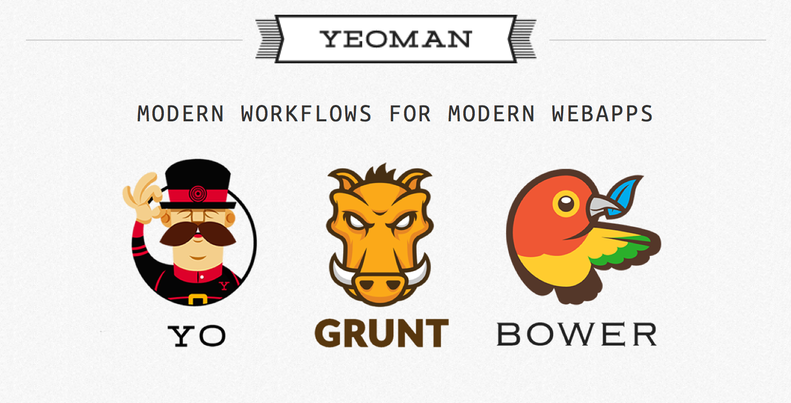

# Angular Template with Grunt/Bower

This template is a starting point for making angular apps.

### Getting Started

1. Clone this repo
2. `cd angular-template/`
3. If you haven't already, you need to install [node.js](http://nodejs.org) and a few npm modules.  With node installed, run `npm install -g bower grunt-cli grunt yo generator-angular less`
4. Run `npm install` and `bower install` (If you have issues with this saying you need administrator access or if it suggests you need to use `sudo` then you have installed `node` and `npm` incorrectly. [This](http://howtonode.org/introduction-to-npm) might help.)
5. Run `rm -rf .git/` to remove the git history from this project so you can start your own
6. Choose a name for your app and run `grunt renameapp:<your-app-name>`.  Be sure that your app name follows convention and is in **lower train case** (also known as [spinal-case](http://en.wikipedia.org/wiki/Letter_case#Special_case_styles) or [kebab-case](http://stackoverflow.com/questions/11273282/whats-the-name-for-snake-case-with-dashes/12273101#12273101))
7. Rename the folder containing this project to match the name from #5 `cd .. && mv angular-template/ <your-app-name>/ && cd <your-app-name>/`.
8. Set an initial version of your app by running `grunt bumpup:<your-version>`.  Please make sure you follow convention and use the [semver](http://semver.org/) standard (e.g. `1.0.0` or `0.1.0-3`, etc).
10. Run `grunt test` and verify test start and run
11. Run `grunt serve` to open the project in your default browser.  If setup went well, you should be able to see the lds sign in and visit a page that shows your app name and version.
12. Run `git init`, followed by `git add -A` and `git commit` to create the first commit for your project.

### The Workflow


[Grunt](http://gruntjs.com), [Bower](http://bower.io) and [Yeoman](http://yeoman.io) are tools for helping you be more productive with front-end development.  If you are unfamiliar with these tools please visit their associated websites.

#### Grunt
Your `Gruntfile.js` contains all the logic and tools for running tasks for you while developing.  It will run a small node server for hosting your front end code.  It will watch changes to your code as you work and live reload the browser so you can see your changes.  It will also run JSHint on your javascript to help you catch any coding errors.  When adding new functionality to your `Gruntfile.js`, you first need to install a grunt plugin.  When you find a plugin you want, you can add it to your `package.json` with `npm install --save-dev <package-name>`.  You can then add the rules to the `Gruntfile.js` and run new tasks.

Here is an example task from the `Gruntfile.js`

```javascript
// Test settings
karma: {
	unit: {
		configFile: 'karma.conf.js',
		singleRun: true
	}
}
```

This example sets up the `grunt-contrib-karma` plugin.  Each plugin has its own rules for how to configure it in the `Gruntfile.js`.  Be sure to visit the plugin's site on GitHub for information on how to use it properly.

#### Bower
Your `bower.json` file contains references to all the javascript, css, and other 3rd party dependencies you need for your project.  You will see that things like angular and angular-route are already there for you.  This file tells bower what to download and stick into your `app/bower_components/` folder when you run `bower install` or `bower update`.  If you would like to include a new 3rd party library, you simply need to run `bower install --save <package-name>`.  If you need to include a specific version of a project, you can do so by appending `#<version-num>` to the package name.

Once this is done, if you have a `grunt serve` instance running, it will automatically add the new files to your `app/index.html` so the file is loaded by the browser.

In the end, Bower helps us to avoid writing the same code twice by easily using code others have written in our project.

#### Yeoman
Yeoman is a scaffolding tool.  It was used to generate this project initially, and then some changes were made to better suit what we need here at the MTC.  Using a generator, you can make the scaffolding for many different types of projects.  With your project set up this way, you can use the `generator-angular` to make all of your angular files and code and have them be automatically attached to your `app/index.html`.  For example:

```shell
yo angular:directive my-directive
```

This will generate a `my-directive.js` file in the `app/scripts/directives/` folder and an accompanying test in the `test/spec/directives` folder.  You can view all of the different angular files you can generate with generator-angular [here](https://github.com/yeoman/generator-angular#app)

>Future versions of the generator have plans to support different project structures, but currently your files are placed in folders matching the file type (directive, filter, etc).  You can always choose to create these files manually in whatever folder structure you want inside of scripts, but you would have to modify the `Gruntfile.js` to make sure any views nested inside these folders got copied correctly

### Testing
Running `grunt test` will run JSHint against all of your code, and run all your unit tests in the `test/` directory.  Tests are written using the `karma` framework, so it might be a good idea to become familiar with karma syntax and look at some [angular testing examples](http://www.sitepoint.com/unit-and-e2e-testing-in-angularjs/) online.

### Release
When you are ready for a release, you can bump up your version with `grunt bump:pre`, `grunt bump:bug`, `grunt bump:minor` or `grunt bump:major` depending on which piece of the version string you are incrementing.  If you have followed the [angular team conventions](https://github.com/ajoslin/conventional-changelog/blob/master/CONVENTIONS.md) for your commit messgages, an automatic changelog is created when you bump.
